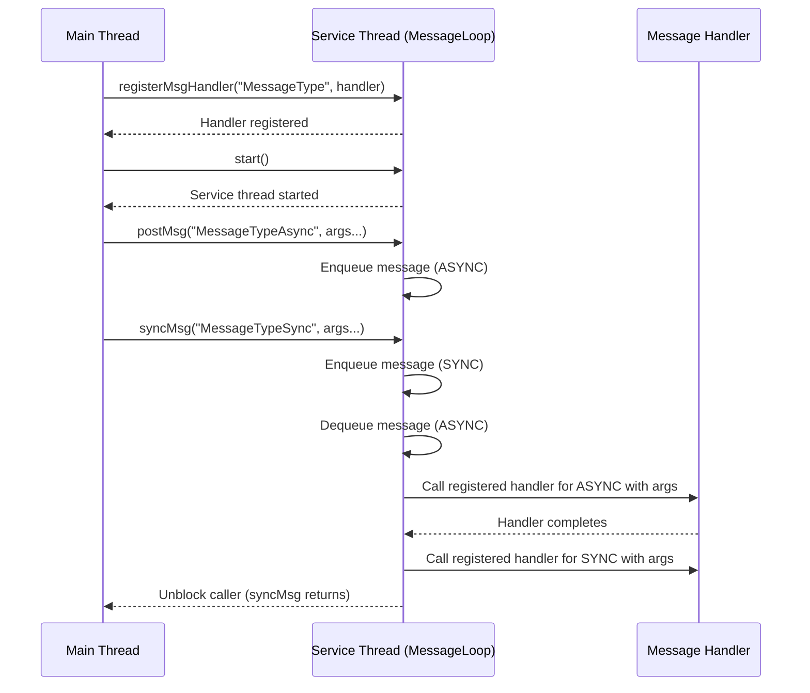

# Nice Services

# Architecture and Design Document

## Table of Contents
1. [Purpose](#purpose)
2. [Project Overview](#project-overview)
3. [System Architecture](#system-architecture)
5. [Threading Model](#threading-model)
6. [Message Passing System](#message-passing-system)
7. [Logging System](#logging-system)
8. [API Design](#api-design)
9. [Build System](#build-system)
10. [Testing Strategy](#testing-strategy)
11. [Future Enhancements](#future-enhancements)

## Purpose

Software architects are often faced with the decision of choosing between a multi-threaded and a multi-process system design. A multi-process architecture offers strong fault tolerance, as individual processes can be independently restarted in case of failure. However, this benefit comes with the cost of inter-process communication (IPC), which introduces overhead. Modern technologies like socket communication and gRPC facilitate IPC, but they also require serialization, deserialization, and secure data transmission—each of which can add significant latency.

In contrast, a multi-threaded design can offer a compelling trade-off. By leveraging lightweight threads within a single process boundary, systems can achieve parallelism with lower latency, as there's no need for data serialization or security overhead typically required in cross-process communication. However, this approach may reduce flexibility in fault isolation, making the system less resilient to individual thread failures.

Nice Services is a project that aims at providing a very light weight and simple API written in C++ for C++ developers that alllows for inter thread communication. 

## Project Overview

The API for Nice Services enables developers to create services as individual threads. Each service runs in its own thread and is responsible for handling multiple tasks. Tasks are registered to a service using the `registerMsgHandler(..)` function that associates a unique message to a task. Once registered, these tasks are triggered when the service receives corresponding messages through the `postMsg(..)` call. Developers must ensure that the order and data types of parameters remain consistent between the `registerMsgHandler(..)` and `postMsg(..)` calls. If there is a mismatch a message will be provided in the debug log. Internally, each service manages an event queue to handle and dispatch messages to the appropriate task handlers. The tasks registered for a service are gauranteed to run on the same thread and in the order the messages came in. Hence all the tasks for a service are thread safe.

Nice Services is a C++20 library that provides a lightweight, thread-safe message-passing framework for building concurrent services. The framework enables developers to create services that communicate through asynchronous message passing, with support for type-safe message handlers and flexible argument passing.

### Key Features
- **Asynchronous Message Passing**: Services communicate through typed messages that are fast.
- **Thread Safety**: Built-in synchronization mechanisms for concurrent access
- **Type Safety**: Template-based message handlers with compile-time type checking
- **Flexible Argument Passing**: Support for various C++ data types including containers. Parameters can be passed directly to the API's instead of containerising them. 
- **Graceful Shutdown Of Services**: Controlled service termination.
- **Logging Integration**: Debugging support has been provided with the help of a custom built thread-safe logging mechanism.
- **External Dependancies**: The only external library that nice-services depends upon are the standard libraries. 

## System Architecture

The system follows a layered architecture with clear separation of concerns:

```
┌─────────────────────────────────────────────────────────────┐
│            Application Layer / Process                      │
│  ┌─────────────────┐  ┌─────────────────┐  ┌──────────────┐ │
│  │   Service 1     │  │   Service 2     │  │   Service N  │ │
│  └─────────────────┘  └─────────────────┘  └──────────────┘ │
└─────────────────────────────────────────────────────────────┘
                              │
┌─────────────────────────────────────────────────────────────┐
│                    NiceService Layer                        │
│  ┌────────────────────────────────────────────────────────┐ │
│  │              NiceService                               │ │
│  │  ┌─────────────┐  ┌─────────────┐  ┌─────────────────┐ │ │
│  │  │ Message     │  │ Thread      │  │ Logger          │ │ │
│  │  │ Handler     │  │ Management  │  │ Integration     │ │ │
│  │  │ Registry    │  │             │  │                 │ │ │
│  │  └─────────────┘  └─────────────┘  └─────────────────┘ │ │
│  └────────────────────────────────────────────────────────┘ │
└─────────────────────────────────────────────────────────────┘
                              │
┌─────────────────────────────────────────────────────────────┐
│                    Threading Layer                          │
│  ┌────────────────────────────────────────────────────────┐ │
│  │              NiceThread                                │ │
│  │  ┌───────────────────────────────────────────────────┐ │ │
│  │  │              MessageLoop                          │ │ │
│  │  │  ┌─────────────┐  ┌─────────────┐  ┌────────────┐ │ │ │
│  │  │  │ Message     │  │ Function    │  │ Thread     │ │ │ │
│  │  │  │ Queue       │  │ Registry    │  │ Control    │ │ │ │
│  │  │  └─────────────┘  └─────────────┘  └────────────┘ │ │ │
│  │  └───────────────────────────────────────────────────┘ │ │
│  └────────────────────────────────────────────────────────┘ │
└─────────────────────────────────────────────────────────────┘
```


## Threading Model

The main thread instantiates a `NiceService`, which in turn spawns a dedicated service thread equipped with its own message queue. The main thread registers a message handler with this service. Any thread with access to the `NiceService` instance can post messages via the `postMsg(..)` method. It is essential to maintain the correct parameter order and data types when posting messages; mismatches will trigger messages in the logs. The system supports both asynchronous and synchronous message posting. Asynchronous messages are posted with `postMsg` and processed in FIFO order, while synchronous messages posted with `syncMsg` block the caller until the handler completes.

Once a message is posted, it is enqueued in the service’s message queue. When the service thread is idle, it dequeues the next message and dispatches the corresponding handler. This ensures all handlers are executed within the context of the service thread. After a handler finishes execution, the service proceeds to the next message in the queue, guaranteeing that tasks are processed sequentially, without concurrency. This continues till the thread is empty. In this state the thread is merely waiting on a mutex.

Messages can be registered with the service at any time, even after the service has been started. If messages are posted on a service have no registered handlers, the posted messages are dropped on the floor.

This behaviour can be explained with the help of a sequence diagram below.

### Sequence Diagram




## Message Passing System

### Message Structure
```cpp
class Message {
    std::string _msg;            // Unique message type identifier
    std::vector<std::any> _args; // Parameters associated with the message.
};
```

### Message Flow
1. **Message Creation**: `postMsg()` creates typed Message objects
2. **Message Enqueueing**: Messages are added to thread-safe queue
3. **Message Processing**: MessageLoop processes messages in FIFO order
4. **Handler Execution**: Registered handlers are called with typed arguments

### Type Safety
- Template-based handler registration ensures compile-time type checking. The matching list of parameters between the registered handler and the call to postMsg(..) is a run time check.
- `std::any` provides runtime type safety for arguments
- Exception handling for type mismatches

## Logging System

Debugging in Nice Services can be enabled by setting the environment variable `NICE_SERVICE_DEBUG=1`. When enabled, a log file named `nice_log.txt` is created in the `/tmp` directory each time a process using Nice Services starts. Note that this environment variable must be set **before** the process is launched. With each startup, any existing log file is overwritten.

The logger is implemented as a singleton, allowing it to be accessed safely from any thread.

### Usage Pattern

```cpp
NiceLogger::instance("ServiceName") << "Log message" << std::endl;
```

## API Design

### Service Creation and Management
```cpp
// Create service
NiceService service("MyService");

// Register message handlers
service.registerMsgHandler("MessageType", handlerFunction);

// Start service
service.start();

// Post asynchronous messages
service.postMsg("MessageType", arg1, arg2, arg3);

// Post synchronous messages and wait for completion
service.syncMsg("MessageType", arg1, arg2, arg3);

// Shutdown service
service.shutdown(ShutdownType::NORMAL);
```

### Synchronous Message Handling

The `syncMsg` API allows a thread to post a message to a service and block until the corresponding handler has completed execution. This is useful for request/response patterns or when a result is needed before proceeding. Internally, the message is enqueued with a type indicating synchronous processing. The service thread processes the message, and the calling thread is blocked until the handler completes, at which point it is unblocked.

- **Thread Safety:** The syncMsg call is thread-safe and can be invoked from any thread.
- **Blocking Behavior:** The calling thread is blocked until the handler finishes.
- **Use Cases:** Request/response, command/acknowledge, or any scenario requiring synchronous coordination between threads.

### Message Handler Registration
```cpp
// Function signature must match expected arguments
void handler(int a, std::string b, std::vector<int> c);

// Registration
service.registerMsgHandler("MessageType", handler);
```

### Supported Data Types
- **Primitive Types**: int, float, double, bool, char, etc.
- **Standard Containers**: vector, map, set, list, deque
- **Pointers and References**: int*, int&, etc.
- **Custom Types**: Any type with proper stream operators

## Build System

### CMake Configuration
- **Minimum Version**: CMake 3.10
- **C++ Standard**: C++20
- **Project Structure**: Modular with separate src, tests, and example directories

### Directory Structure
```
nice-services/
├── CMakeLists.txt          # Root build configuration
├── inc/                    # Header files
├── src/                    # Implementation files
├── tests/                  # Test files
├── example/                # Usage examples
└── docs/                   # Documentation
```

## Testing Strategy


## Future Enhancements


## Conclusion

Nice Services provides a robust foundation for building concurrent, message-driven applications in C++. The architecture emphasizes simplicity, type safety, and performance while maintaining flexibility for future enhancements. The modular design allows for easy extension and customization to meet specific application requirements.

The framework's thread-safe message passing system, combined with its template-based type safety, makes it suitable for a wide range of concurrent programming scenarios, from simple service communication to complex distributed systems. 