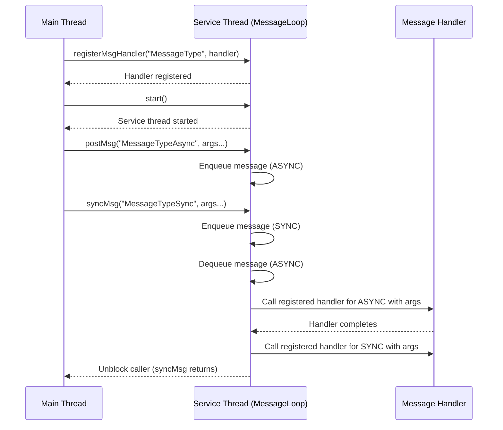

# Chirp

	

# Architecture and Design Document

## Table of Contents
1. [Purpose](#purpose)
2. [Project Overview](#project-overview)
3. [System Architecture](#system-architecture)
4. [Factory Pattern](#factory-pattern)
5. [Timer System](#timer-system)
6. [Watchdog System](#watchdog-system)
7. [Threading Model](#threading-model)
8. [Message Passing System](#message-passing-system)
9. [Logging System](#logging-system)
10. [API Design](#api-design)
11. [Build System](#build-system)
12. [Testing Strategy](#testing-strategy)
13. [Future Enhancements](#future-enhancements)

## Purpose

Software architects are often faced with the decision of choosing between a multi-threaded and a multi-process system design. A multi-process architecture offers strong fault tolerance, as individual processes can be independently restarted in case of failure. However, this benefit comes with the cost of inter-process communication (IPC), which introduces overhead. Modern technologies like socket communication and gRPC facilitate IPC, but they also require serialization, deserialization, and secure data transmission—each of which can add significant latency.

In contrast, a multi-threaded design can offer a compelling trade-off. By leveraging lightweight threads within a single process boundary, systems can achieve parallelism with lower latency, as there's no need for data serialization or security overhead typically required in cross-process communication. However, this approach may reduce flexibility in fault isolation, making the system less resilient to individual thread failures.

Chirp is a project that aims at providing a very light weight and simple API written in C++ for C++ developers that alllows for inter thread communication and management. 

## Project Overview

The API for Chirp enables developers to create services as individual threads. Each service runs in its own thread and is responsible for handling multiple tasks. Tasks are registered to a service using the `registerMsgHandler(..)` function that associates a unique message to a task. This function returns a `ChirpError::Error` code indicating success or failure. Once registered, these tasks are triggered when the service receives corresponding messages through the `postMsg(..)` call.  

Developers must ensure that the order and data types of parameters remain consistent between the handler passed to`registerMsgHandler(..)` and `postMsg(..)` calls. If there is a mismatch, the helper methods will return `INVALID_ARGUMENTS` at run time and a message will be provided in the debug log.  Internally, each service manages an event queue to handle and dispatch messages to the appropriate task handlers. The tasks registered for a service are gauranteed to run on the same thread and in the order the messages came in. Hence all the tasks for a service are thread safe. 

Calls can be made to the chirp service ***synchronously too***. This allows the caller to block till the handler for the message is processed by the service.  The Chirp Servce that must process the synchronous call must process all the messages in the queue that is ahead of the call and then process the synchronous call. Till then the caller will be blocked. Hence this feature must be used cautiosly. 

A timer can also be created on a chirp thread which asynchronously interrupts based on the duration provided by the user. ***The timer does not take up any additional threads for operation***. A WatchDog capability has also been provided that can be used to check the health of the threads and provide alerts if the thread has been stuck for a while. 

Chirp is a C++20 library that provides a lightweight, thread-safe message-passing framework for building concurrent services. The framework enables developers to create services that communicate through asynchronous or synchronous message passing, with support for type-safe message handlers and flexible argument passing.

### Key Features
- **Message Passing**: Services communicate through typed messages that are fast.
- **Thread Safety**: Built-in synchronization mechanisms for concurrent access
- **Type Safety**: Template-based message handlers with compile-time type checking
- **Flexible Argument Passing**: Support for various C++ data types including containers. Parameters can be passed directly to the API's instead of containerising them. 
- **Graceful Shutdown Of Services**: Controlled service termination.
- **Logging Integration**: Debugging support has been provided with the help of a custom built thread-safe logging mechanism.
- **Factory Pattern**: Centralized service creation and lifecycle management through the ChirpFactory.
- **External Dependancies**: The only external library that chirp depends upon are the standard libraries. 
- **Timer Support:** Services can be asynchronously interrupted on a regular basis, with timers. 
- **Watchdog Support**: Services can be monitored by a watchdog and the caller can be notified if a services is not responsive.

## System Architecture

The system follows a layered architecture with clear separation of concerns:

```
┌─────────────────────────────────────────────────────────────┐
│            Application Layer / Process                      │
│  ┌─────────────────┐  ┌─────────────────┐  ┌──────────────┐ │
│  │   Service 1     │  │   Service 2     │  │   Service N  │ │
│  └─────────────────┘  └─────────────────┘  └──────────────┘ │
└─────────────────────────────────────────────────────────────┘
                              │
┌─────────────────────────────────────────────────────────────┐
│                    ChirpService Layer                       │
│  ┌────────────────────────────────────────────────────────┐ │
│  │              ChirpService                              │ │
│  │  ┌─────────────┐  ┌─────────────┐  ┌─────────────────┐ │ │
│  │  │ Message     │  │ Thread      │  │ Logger          │ │ │
│  │  │ Handler     │  │ Management  │  │ Integration     │ │ │
│  │  │ Registry    │  │             │  │                 │ │ │
│  │  └─────────────┘  └─────────────┘  └─────────────────┘ │ │
│  └────────────────────────────────────────────────────────┘ │
└─────────────────────────────────────────────────────────────┘
                              │
┌─────────────────────────────────────────────────────────────┐
│                    Threading Layer                          │
│  ┌────────────────────────────────────────────────────────┐ │
│  │              ChirpThread                               │ │
│  │  ┌───────────────────────────────────────────────────┐ │ │
│  │  │              MessageLoop                          │ │ │
│  │  │  ┌─────────────┐  ┌─────────────┐  ┌────────────┐ │ │ │
│  │  │  │ Message     │  │ Function    │  │ Thread     │ │ │ │
│  │  │  │ Queue       │  │ Registry    │  │ Control    │ │ │ │
│  │  │  └─────────────┘  └─────────────┘  └────────────┘ │ │ │
│  │  └───────────────────────────────────────────────────┘ │ │
│  └────────────────────────────────────────────────────────┘ │
└─────────────────────────────────────────────────────────────┘
```


## Threading Model

The main thread instantiates a `ChirpService`, which in turn spawns a dedicated service thread equipped with its own message queue. The main thread registers a message handler with this service. Any thread with access to the `ChirpService` instance can post messages via the `postMsg(..)` method. It is essential to maintain the correct parameter order and data types when posting messages; mismatches will trigger messages in the logs. The system supports both asynchronous and synchronous message posting. Asynchronous messages are posted with `postMsg` and processed in FIFO order, while synchronous messages posted with `syncMsg` block the caller until the handler completes. This would mean that the service that must handle the synchronous call must process all teh messages in the queue ahead of it before it processes the synchronous call.

### Thread State Management

The ChirpThread maintains a state machine to ensure proper message handling:

- **NOT_STARTED**: Initial state, no messages can be posted
- **STARTED**: Thread has been created and started, messages can be posted
- **RUNNING**: Thread is actively processing messages, messages can be posted
- **STOPPED**: Thread has been stopped, no messages can be posted. No messages shall be processed.

Messages can only be enqueued when the thread is in STARTED or RUNNING state. Attempting to post messages in other states will return `ChirpError::INVALID_SERVICE_STATE`.

Once a message is posted, it is enqueued in the service’s message queue. When the service thread is idle, it dequeues the next message and dispatches the corresponding handler. This ensures all handlers are executed within the context of the service thread. After a handler finishes execution, the service proceeds to the next message in the queue, guaranteeing that tasks are processed sequentially, without concurrency. This continues till the thread is empty. In this state the thread is merely waiting on a mutex.

Messages can be registered with the service at any time, even after the service has been started. If messages are posted on a service have no registered handlers, the posted messages are dropped on the floor.

This behaviour can be explained with the help of a sequence diagram below.

### Sequence Diagram




## Message Passing System

### Message Handler Interface

The message handler system provides a more object-oriented approach. The new interface exclusively supports member function handlers bound to object instances.

When handlers are registered with only one Chirp Service, they are inherently thread-safe. All the handlers will be called on the same thread. If the same handler is registered across multiple Chirp Services, this thread-safety guarantee no longer holds. To prevent race conditions in such scenarios, a mutex should be employed as appropriate.

#### Handler Registration Pattern
```cpp
class ServiceHandlers {
public:
    void asyncHandler(const std::string& message) {
        // Can access instance data and state
        std::cout << "Processing: " << message << std::endl;
    }
    
    void syncHandler(const std::string& message, int value) {
        // Can access instance methods and members
        processMessage(message, value);
    }
    
private:
    void processMessage(const std::string& msg, int val) {
        // Private helper methods accessible to handlers
    }
};

// Usage
ServiceHandlers handler;
ChirpError::Error err = service.registerMsgHandler("AsyncMessage", &handler, &ServiceHandlers::asyncHandler);
// Check error
..
    
error = service.registerMsgHandler("SyncMessage", &handlers, &ServiceHandlers::syncHandler);
// Check error
..
```

### Message Structure

The message structure shown below is for **internal use only**.

```cpp
class Message {
    std::string _msg;            // Unique message type identifier
    std::vector<std::any> _args; // Parameters associated with the message.
};
```

### Message Flow
1. **Message Creation**: `postMsg()` creates typed Message objects
2. **Message Enqueueing**: Messages are added to thread-safe queue
3. **Message Processing**: MessageLoop processes messages in FIFO order
4. **Handler Execution**: Registered handlers are called with typed arguments

### Type Safety
- Template-based handler registration ensures compile-time type checking. The matching list of parameters between the registered handler and the call to postMsg(..) is a run time check.
- `std::any` provides runtime type safety for arguments
- Exception handling for type mismatches

## Logging System

Debugging in Chirp can be enabled by setting the environment variable `CHIRP_SERVICES_DEBUG=1`. When enabled, a log file named `chirp_log.txt` is created in the `/tmp` directory each time a process using Chirp starts. Note that this environment variable must be set **before** the process is launched. With each startup, any existing log file is overwritten.

The logger is implemented as a singleton, allowing it to be accessed safely from any thread. This may allow the user of the library to get a better understanding of the Framework based on activities in the process.

### Usage Pattern

```cpp
ChirpLogger::instance("ServiceName") << "Log message" << std::endl;
```

## API Design

All public headers are located in the **`inc`** folder. The source tree follows a conventional C++ interface pattern, providing a clean abstraction over implementation details. The implementation itself resides in the **`src`** folder.

Example applications, such as **`chirp_test`** and **`chirp_timer_demo`**, can be found in the **`example`** folder and demonstrate typical API usage. During compilation, the sources produce a shared library in the **`lib`** folder and place the example binaries in the **`bin`** folder.

Developers should take care not to include any headers from the **`src`** directory when using this package.

### Error Handling

The Chirp framework provides comprehensive error handling through the `ChirpError::Error` enum class. All public interfaces that can fail now include error parameters to provide detailed information about what went wrong.

#### Error Types
- **Service Errors**: Creation, lifecycle, and state management failures
- **Resource Errors**: Memory allocation and thread creation failures
- **Message Errors**: Handler registration and message processing failures
- **Message Posting Errors**: Memory allocation failures when posting messages
- **Thread State Errors**: Attempting to post messages when thread is not in STARTED or RUNNING state
- **System Errors**: Internal errors, timeouts, and configuration issues

#### Error Handling Pattern
```cpp
ChirpError::Error error;
Chirp* service = nullptr;
ChirpError::Error error = factory.createService("MyService", &service);
if (error != ChirpError::SUCCESS) {
    std::cout << "Service creation failed: " << ChirpError::errorToString(error) << std::endl;
    return;
}
```

**Thread State Validation**: Messages can only be posted when the service thread is in STARTED or RUNNING state. Attempting to post messages before the service is started or after it's stopped will return `ChirpError::INVALID_SERVICE_STATE`.

### Synchronous Message Handling

The `syncMsg` API allows a thread to post a message to a service and block until the corresponding handler has completed execution. This is useful for request/response patterns or when a result is needed before proceeding. Internally, the message is enqueued with a type indicating synchronous processing. The service thread processes the message, and the calling thread is blocked until the handler completes, at which point it is unblocked.

- **Thread Safety:** The syncMsg call is thread-safe and can be invoked from any thread.
- **Blocking Behavior:** The calling thread is blocked until the handler finishes.
- **Use Cases:** Request/response, command/acknowledge, or any scenario requiring synchronous coordination between threads.

### Message Handler Registration
```cpp
// Handler class with methods that match expected arguments
class MessageHandlers {
public:
    void handler(int a, std::string b, std::vector<int> c);
};

// Create handler instance
MessageHandlers handlers;

// Registration using object instance and member method pointer
ChirpError::Error error = service.registerMsgHandler("MessageType", &handlers, &MessageHandlers::handler);
// Check for error
```

**Note**: The interface only supports member function handlers bound to object instances. This provides better encapsulation and allows handlers to access instance state and data.

### Supported Data Types
- **Primitive Types**: int, float, double, bool, char, etc.
- **Standard Containers**: vector, map, set, list, deque
- **Pointers and References**: int*, int&, etc.
- **Custom Types**: Any type with proper stream operators

## Factory Pattern

The ChirpFactory provides a centralized approach to creating and managing Chirp services through the Factory pattern. This design pattern ensures controlled service creation, centralized lifecycle management, and provides a clean interface for service instantiation.

### Factory Architecture

```
┌─────────────────────────────────────────────────────────────┐
│                    Factory Layer                            │
│  ┌────────────────────────────────────────────────────────┐ │
│  │              ChirpFactory                              │ │
│  │  ┌─────────────┐  ┌─────────────┐  ┌─────────────────┐ │ │
│  │  │ Service     │  │ Service     │  │ Service         │ │ │
│  │  │ Creation    │  │ Lifecycle   │  │ Registry        │ │ │
│  │  │ Management  │  │ Management  │  │                 │ │ │
│  │  └─────────────┘  └─────────────┘  └─────────────────┘ │ │
│  └────────────────────────────────────────────────────────┘ │
└─────────────────────────────────────────────────────────────┘
                              │
┌─────────────────────────────────────────────────────────────┐
│                    Service Layer                            │
│  ┌─────────────────┐  ┌─────────────────┐  ┌──────────────┐ │
│  │   Service 1     │  │   Service 2     │  │   Service N  │ │
│  └─────────────────┘  └─────────────────┘  └──────────────┘ │
└─────────────────────────────────────────────────────────────┘
```

### Factory Features

- **Singleton Pattern**: Ensures only one factory instance exists across the application
- **Thread Safety**: All factory operations are protected by mutex locks
- **Service Registry**: Maintains a map of all created services for lifecycle management
- **Centralized Control**: Provides unified interface for service creation, retrieval, and destruction
- **Interface Abstraction**: Supports dependency injection and testability through the IChirpFactory interface

### Factory Usage Patterns

```cpp
// Get the singleton factory instance
auto& factory = IChirpFactory::getInstance();

// Create services through the factory
auto service1 = factory.createService("LoggerService");
auto service2 = factory.createService("NetworkService");

// Create handler instances and register handlers
LogHandlers logHandlers;
ChirpError::Error error = service1->registerMsgHandler("Log", &logHandlers, &LogHandlers::logHandler);
// Check error
service1->start();

// Retrieve existing services
auto existingService = factory.getService("LoggerService");

// Post asynchronous messages with error handling
ChirpError::Error error = service1->postMsg("Log", arg1, arg2, arg3);
// Check error

// Get service count
size_t count = factory.getServiceCount();

// Destroy specific service
factory.destroyService("NetworkService");

// Shutdown all services
factory.shutdownAllServices();
```

## Timer System

The ChirpTimer system provides a lightweight, high-precision timer mechanism integrated directly into the Chirp message loop. Timers operate within the service thread context and deliver timer events through the standard message passing mechanism, ensuring thread safety and consistent ordering with other messages. The timer does not create any additional thread, so the number of threads does not grow any more than the number created by chirp service.

### Timer Architecture

The timer system consists of three main components:

```
┌─────────────────────────────────────────────────────────────┐
│                    Chirp Service Layer                      │
│  ┌────────────────────────────────────────────────────────┐ │
│  │              Chirp Service                             │ │
│  │  • addChirpTimer(IChirpTimer*)                         │ │
│  │  • removeChirpTimer(IChirpTimer*)                      │ │
│  └────────────────────────────────────────────────────────┘ │
└─────────────────────────────────────────────────────────────┘
                              │
┌─────────────────────────────────────────────────────────────┐
│                    Message Loop Layer                       │
│  ┌────────────────────────────────────────────────────────┐ │
│  │              MessageLoop                               │ │
│  │  ┌──────────────────────────────────────────────────┐  │ │
│  │  │  • fireTimerHandlers()                           │  │ │
│  │  │  • fireRegularHandlers()                         │  │ │
│  │  └──────────────────────────────────────────────────┘  │ │
│  └────────────────────────────────────────────────────────┘ │
└─────────────────────────────────────────────────────────────┘
                              │
┌─────────────────────────────────────────────────────────────┐
│                    Timer Manager Layer                      │
│  ┌────────────────────────────────────────────────────────┐ │
│  │              TimerManager                              │ │
│  │  • computeNextTimerFirringTime()                       │ │
│  │  • getDurationToNextTimerEvent()                       │ │
│  │  • getElapsedTimers(elapsedTimers&)                    │ │
│  │  • rescheduleTimers(firedTimers&)                      │ │
│  └────────────────────────────────────────────────────────┘ │
└─────────────────────────────────────────────────────────────┘
                              │
┌─────────────────────────────────────────────────────────────┐
│                    Timer Implementation                     │
│  ┌────────────────────────────────────────────────────────┐ │
│  │              ChirpTimer (IChirpTimer)                  │ │
│  │  • _messageToDeliver (string)                          │ │
│  │  • _duration (milliseconds)                            │ │
│  │  • _isRunning (bool)                                   │ │
│  │  • start() / stop()                                    │ │
│  └────────────────────────────────────────────────────────┘ │
└─────────────────────────────────────────────────────────────┘
```

### Timer Scheduling Algorithm

The timer system uses an efficient scheduling algorithm.

1. **Initial Scheduling**: When a timer is started:
   
   ```cpp
   nextFiringTime = timerStartTime + duration
   ```
   
2. **Finding Next Timer**: In case there are multiple timers, O(n) linear search to find minimum:
   
   ```cpp
   _nextFirringTimerIndex = index of timer with minimum firing time
   _nextFiringTime = minimum firing time value
   ```
   
   _nextFiringTime is used by the event loop to wait before firing the next timer event.
   
3. **Rescheduling After Fire**: Only fired timers are rescheduled:
   
   ```cpp
   nextFiringTime = previousFiringTime + duration
   ```

This approach ensures:
- **Independent Timers**: Each timer maintains its own schedule
- **Precision**: Uses previous firing time to avoid drift
- **Efficiency**: No full sort, only O(n) scan after changes

### Precision and Tolerance

The timer system accounts for scheduling delays and timing precision:

- **Tolerance Window**: 2ms tolerance for elapsed timer detection
  ```cpp
  if (timerPair.second <= currentTime + std::chrono::milliseconds(2))
  ```
- **Reason**: Accounts for thread scheduling delays and microsecond-level timing variations
- **Result**: Timers fire consistently at their target intervals

### Design Considerations

The timer handlers are running on the same Chirp service thread as regular handlers. So if tasks take up longer execution times as compared to the timer duration then the timer accuracy shall be affected.

### Timer Usage Pattern

```cpp
// Create a handler class
class TimerHandlers {
public:
    ChirpError::Error onTimerTick() {
        std::cout << "Timer fired!" << std::endl;
        return ChirpError::SUCCESS;
    }
};

// Create service and handler
ChirpError::Error error;
Chirp service("TimerService", error);
TimerHandlers handlers;

// Register timer message handler
error = service.registerMsgHandler("TimerTick", &handlers, 
                                   &TimerHandlers::onTimerTick);

// Create timer with message and interval
ChirpTimer timer("TimerTick", std::chrono::milliseconds(1000));

// Start service and timer
service.start();
timer.start();

// Add timer to service (auto-schedules)
service.addChirpTimer(&timer);

// Timer will now fire every 1000ms. Handler executes in service thread context

// Stop and remove timer
timer.stop();
service.removeChirpTimer(&timer);
```

### Timer Limitations and Considerations

- **Minimum Resolution**: Practical minimum ~2ms due to OS scheduling
- **Handler Blocking**: Long-running handlers delay subsequent timers
- **Timer Accuracy**: Affected by system load and handler execution time
- **Memory**: O(n) space for n active timers
- **Scheduling Complexity**: O(n) to find next timer after reschedule

## Watchdog System

The ChirpWatchdog system provides service health monitoring and unresponsiveness detection for Chirp services. It monitors services by tracking periodic "pet" signals and alerts when services fail to respond within expected timeframes.

### Watchdog Architecture

The watchdog system consists of three main components:

```
┌─────────────────────────────────────────────────────────────┐
│                    Watchdog Layer                           │
│  ┌────────────────────────────────────────────────────────┐ │
│  │              ChirpWatchDog                             │ │
│  │  • configure(factory, petDuration)                     │ │
│  │  • start() / stop()                                    │ │
│  │  • getChirpService()                                   │ │
│  └────────────────────────────────────────────────────────┘ │
└─────────────────────────────────────────────────────────────┘
                              │
┌─────────────────────────────────────────────────────────────┐
│                    Pet Timer Layer                          │
│  ┌────────────────────────────────────────────────────────┐ │
│  │  Per-Service Pet Timers (ChirpTimer)                   │ │
│  │  • _PetTimer_ServiceName (message)                     │ │
│  │  • petDuration (interval)                              │ │
│  │  • onPetTimerFired(serviceName)                        │ │
│  └────────────────────────────────────────────────────────┘ │
└─────────────────────────────────────────────────────────────┘
                              │
┌─────────────────────────────────────────────────────────────┐
│                    Monitor Timer Layer                      │
│  ┌────────────────────────────────────────────────────────┐ │
│  │  Monitor Timer (ChirpTimer)                            │ │
│  │  • monitorTimerElapsed (message)                       │ │
│  │  • 2 × petDuration (interval)                          │ │
│  │  • onMonitorTick(timerMessage)                         │ │
│  └────────────────────────────────────────────────────────┘ │
└─────────────────────────────────────────────────────────────┘
                              │
┌─────────────────────────────────────────────────────────────┐
│                    Monitored Services                       │
│  ┌─────────────────┐  ┌─────────────────┐  ┌──────────────┐ │
│  │   Service 1     │  │   Service 2     │  │   Service N  │ │
│  │  (monitored)    │  │  (monitored)    │  │  (monitored) │ │
│  └─────────────────┘  └─────────────────┘  └──────────────┘ │
└─────────────────────────────────────────────────────────────┘
```

### Watchdog Design Principles

1. **Timer-Based Monitoring**: Uses ChirpTimer infrastructure - no additional threads
2. **Pet Signal Pattern**: Services "pet" the watchdog when their message queue becomes idle
3. **Threshold Detection**: Monitors detect missed pets when time exceeds 2 × petDuration
4. **Alert Mechanism**: Posts `MissedPetMessage` to watchdog's internal service for handling

### Watchdog Operation Flow

#### 1. Configuration Phase

```cpp
// Create watchdog
IChirpWatchDog* watchdog = IChirpWatchDog::createWatchdog("Watchdog");

// Configure with factory and pet duration
watchdog->configure(factory, std::chrono::milliseconds(1000));
```

#### 2. Starting the dog

```cpp
// Register alert handler
WatchdogHandler handler;
watchdog->getChirpService()->registerMsgHandler(IChirpWatchDog::MissedPetMessage, 
                                                &handler, 
                                                &WatchdogHandler::onMissedPet);

// Start watchdog
watchdog->start();
```

#### 3. Runtime Monitoring

**Pet Timer Firing (when service is idle):**

The handling of the pet timer is transparently done by the watchdog.

```
Service Queue Idle → Pet Timer Fires → onPetTimerFired() called
→ Records current time in _lastPetTime[serviceName]
```

**Monitor Timer Firing (every 2 × petDuration):**

The monitor timer handler wakes up at the duration equivalent to twice the duration and checks  to see if the service has missed its pet. If it has then a message is sent to the registered handler for `MissedPetMessage`.

```
Monitor Timer Fires → onMonitorTick() called
→ For each monitored service:
    - Check time since last pet
    - If > 2.1 × petDuration:
        → Post MissedPetMessage to watchdog service
        → Alert handler invoked
```

#### 4. Shutdown Phase

```cpp
watchdog->stop();
delete watchdog;
```

**What happens:**

- Stops all pet timers
- Removes pet timers from monitored services
- Stops monitor timer
- Removes monitor timer from watchdog service
- Shuts down watchdog's internal service
- Cleans up all timer resources

### Pet Timer Mechanism

Pet timers only fire when a service's message queue is idle:

**Key Insight:** Pet timers measure service responsiveness, not just uptime. A busy service won't pet, triggering alerts.

### Missed Pet Detection Algorithm

**Threshold Calculation:**
- Pet interval: `petDuration`
- Monitor interval: `2 × petDuration`
- Alert threshold: `2.1 × petDuration` (10% tolerance)

### Watchdog Characteristics

**Advantages:**

- **No Additional Threads**: Uses existing ChirpTimer infrastructure
- **Idle Detection**: Detects busy/hung services, not just crashes
- **Configurable**: Pet duration adjustable per deployment
- **Scalable**: Monitors any number of services
- **Thread-Safe**: All operations mutex-protected

**Limitations:**

- **Resolution**: Limited by pet duration (typically 100ms-10s)
- **False Positives**: Legitimately busy services may trigger alerts
- **Overhead**: One timer per monitored service + one monitor timer
- **Latency**: Detection delay of up to 2 × petDuration

**Best Practices:**

- Set `petDuration` > longest expected handler execution time
- Use 2-3× margin for threshold to avoid false positives
- Monitor critical services only to minimize overhead
- Implement exponential backoff for repeated alerts
- Consider service priority when setting pet durations

### Watchdog Integration with Factory

The watchdog integrates with ChirpFactory to discover and monitor services:

This design allows dynamic service discovery and monitoring without hardcoding service names.

## Build System

### CMake Configuration

- **Minimum Version**: CMake 3.10
- **C++ Standard**: C++20
- **Project Structure**: Modular with separate src, tests, and example directories

### Directory Structure

```
nice-services/
├── CMakeLists.txt          # Root build configuration
├── inc/                    # Public header files
├── src/                    # Implementation files
├── tests/                  # Test files
├── example/                # Usage examples
└── docs/                   # Documentation
```

## Testing Strategy


## Future Enhancements


## Conclusion

Chirp provides a robust foundation for building concurrent, message-driven applications in C++ that involves multiple threads. The architecture emphasizes simplicity, type safety, and performance while maintaining flexibility for future enhancements. The modular design allows for easy extension and customization to meet specific application requirements.

The framework's thread-safe message passing system, combined with its template-based type safety and object-oriented message handler interface, makes it suitable for a wide range of concurrent programming scenarios, from simple service communication to complex distributed systems. The recent refactoring to member function-based handlers provides better encapsulation and state management capabilities. 