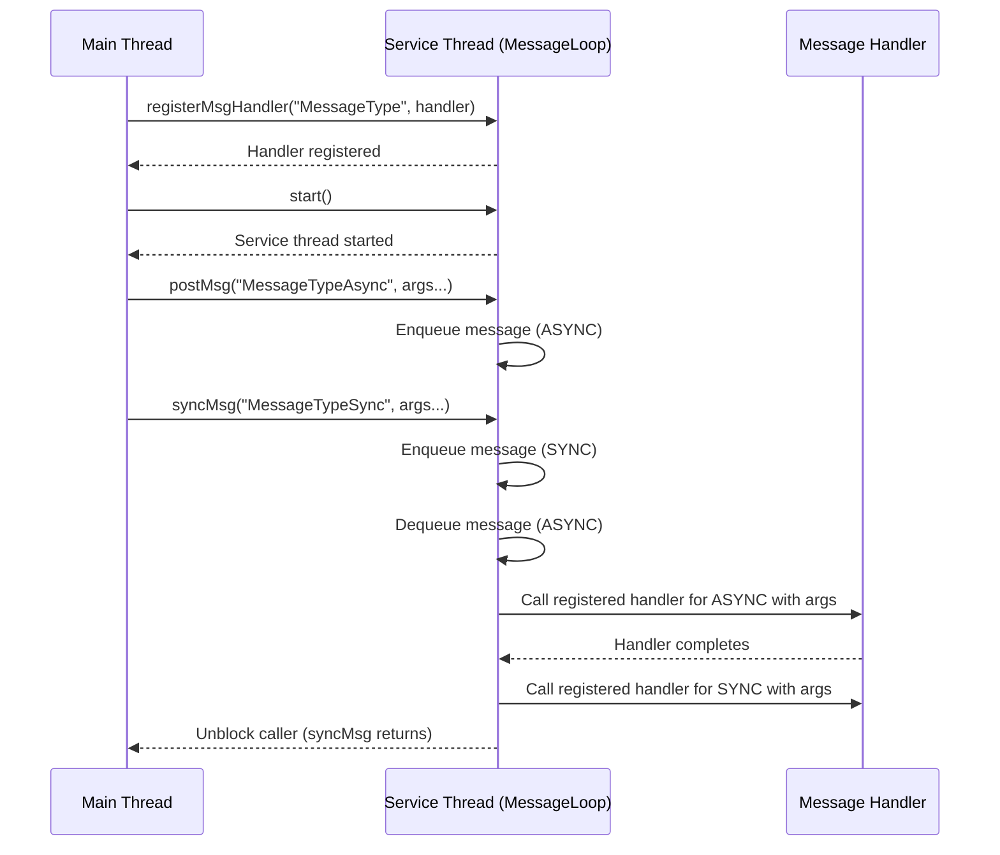

# Chirp

# Architecture and Design Document

## Table of Contents
1. [Purpose](#purpose)
2. [Project Overview](#project-overview)
3. [System Architecture](#system-architecture)
4. [Factory Pattern](#factory-pattern)
5. [Chirp Timer](#chirp-timer)
6. [Threading Model](#threading-model)
7. [Message Passing System](#message-passing-system)
8. [Logging System](#logging-system)
9. [API Design](#api-design)
10. [Build System](#build-system)
11. [Testing Strategy](#testing-strategy)
12. [Future Enhancements](#future-enhancements)

## Purpose

Software architects are often faced with the decision of choosing between a multi-threaded and a multi-process system design. A multi-process architecture offers strong fault tolerance, as individual processes can be independently restarted in case of failure. However, this benefit comes with the cost of inter-process communication (IPC), which introduces overhead. Modern technologies like socket communication and gRPC facilitate IPC, but they also require serialization, deserialization, and secure data transmission—each of which can add significant latency.

In contrast, a multi-threaded design can offer a compelling trade-off. By leveraging lightweight threads within a single process boundary, systems can achieve parallelism with lower latency, as there's no need for data serialization or security overhead typically required in cross-process communication. However, this approach may reduce flexibility in fault isolation, making the system less resilient to individual thread failures.

Chirp is a project that aims at providing a very light weight and simple API written in C++ for C++ developers that alllows for inter thread communication. 

## Project Overview

The API for Chirp enables developers to create services as individual threads. Each service runs in its own thread and is responsible for handling multiple tasks. Tasks are registered to a service using the `registerMsgHandler(..)` function that associates a unique message to a task. This function returns a `ChirpError::Error` code indicating success or failure. Once registered, these tasks are triggered when the service receives corresponding messages through the `postMsg(..)` call. Developers must ensure that the order and data types of parameters remain consistent between the `registerMsgHandler(..)` and `postMsg(..)` calls. If there is a mismatch, the helper methods will return `INVALID_ARGUMENTS` and a message will be provided in the debug log. Internally, each service manages an event queue to handle and dispatch messages to the appropriate task handlers. The tasks registered for a service are gauranteed to run on the same thread and in the order the messages came in. Hence all the tasks for a service are thread safe.

Chirp is a C++20 library that provides a lightweight, thread-safe message-passing framework for building concurrent services. The framework enables developers to create services that communicate through asynchronous message passing, with support for type-safe message handlers and flexible argument passing.

### Key Features
- **Asynchronous Message Passing**: Services communicate through typed messages that are fast.
- **Thread Safety**: Built-in synchronization mechanisms for concurrent access
- **Type Safety**: Template-based message handlers with compile-time type checking
- **Flexible Argument Passing**: Support for various C++ data types including containers. Parameters can be passed directly to the API's instead of containerising them. 
- **Graceful Shutdown Of Services**: Controlled service termination.
- **Logging Integration**: Debugging support has been provided with the help of a custom built thread-safe logging mechanism.
- **Factory Pattern**: Centralized service creation and lifecycle management through the ChirpFactory singleton.
- **External Dependancies**: The only external library that chirp depends upon are the standard libraries. 

## System Architecture

The system follows a layered architecture with clear separation of concerns:

```
┌─────────────────────────────────────────────────────────────┐
│            Application Layer / Process                      │
│  ┌─────────────────┐  ┌─────────────────┐  ┌──────────────┐ │
│  │   Service 1     │  │   Service 2     │  │   Service N  │ │
│  └─────────────────┘  └─────────────────┘  └──────────────┘ │
└─────────────────────────────────────────────────────────────┘
                              │
┌─────────────────────────────────────────────────────────────┐
│                    ChirpService Layer                        │
│  ┌────────────────────────────────────────────────────────┐ │
│  │              ChirpService                               │ │
│  │  ┌─────────────┐  ┌─────────────┐  ┌─────────────────┐ │ │
│  │  │ Message     │  │ Thread      │  │ Logger          │ │ │
│  │  │ Handler     │  │ Management  │  │ Integration     │ │ │
│  │  │ Registry    │  │             │  │                 │ │ │
│  │  └─────────────┘  └─────────────┘  └─────────────────┘ │ │
│  └────────────────────────────────────────────────────────┘ │
└─────────────────────────────────────────────────────────────┘
                              │
┌─────────────────────────────────────────────────────────────┐
│                    Threading Layer                          │
│  ┌────────────────────────────────────────────────────────┐ │
│  │              ChirpThread                                │ │
│  │  ┌───────────────────────────────────────────────────┐ │ │
│  │  │              MessageLoop                          │ │ │
│  │  │  ┌─────────────┐  ┌─────────────┐  ┌────────────┐ │ │ │
│  │  │  │ Message     │  │ Function    │  │ Thread     │ │ │ │
│  │  │  │ Queue       │  │ Registry    │  │ Control    │ │ │ │
│  │  │  └─────────────┘  └─────────────┘  └────────────┘ │ │ │
│  │  └───────────────────────────────────────────────────┘ │ │
│  └────────────────────────────────────────────────────────┘ │
└─────────────────────────────────────────────────────────────┘
```


## Threading Model

The main thread instantiates a `ChirpService`, which in turn spawns a dedicated service thread equipped with its own message queue. The main thread registers a message handler with this service. Any thread with access to the `ChirpService` instance can post messages via the `postMsg(..)` method. It is essential to maintain the correct parameter order and data types when posting messages; mismatches will trigger messages in the logs. The system supports both asynchronous and synchronous message posting. Asynchronous messages are posted with `postMsg` and processed in FIFO order, while synchronous messages posted with `syncMsg` block the caller until the handler completes.

### Thread State Management

The ChirpThread maintains a state machine to ensure proper message handling:

- **NOT_STARTED**: Initial state, no messages can be posted
- **STARTED**: Thread has been created and started, messages can be posted
- **RUNNING**: Thread is actively processing messages, messages can be posted
- **STOPPED**: Thread has been stopped, no messages can be posted

Messages can only be enqueued when the thread is in STARTED or RUNNING state. Attempting to post messages in other states will return `ChirpError::INVALID_SERVICE_STATE`.

Once a message is posted, it is enqueued in the service’s message queue. When the service thread is idle, it dequeues the next message and dispatches the corresponding handler. This ensures all handlers are executed within the context of the service thread. After a handler finishes execution, the service proceeds to the next message in the queue, guaranteeing that tasks are processed sequentially, without concurrency. This continues till the thread is empty. In this state the thread is merely waiting on a mutex.

Messages can be registered with the service at any time, even after the service has been started. If messages are posted on a service have no registered handlers, the posted messages are dropped on the floor.

This behaviour can be explained with the help of a sequence diagram below.

### Sequence Diagram




## Message Passing System

### Message Handler Interface

The message handler system has been refactored to provide a more object-oriented approach. The new interface exclusively supports member function handlers bound to object instances, offering several advantages:

#### Handler Registration Pattern
```cpp
class ServiceHandlers {
public:
    void asyncHandler(const std::string& message) {
        // Can access instance data and state
        std::cout << "Processing: " << message << std::endl;
    }
    
    void syncHandler(const std::string& message, int value) {
        // Can access instance methods and members
        processMessage(message, value);
    }
    
private:
    void processMessage(const std::string& msg, int val) {
        // Private helper methods accessible to handlers
    }
};

// Usage
ServiceHandlers handlers;
ChirpError::Error error = service.registerMsgHandler("AsyncMessage", &handlers, &ServiceHandlers::asyncHandler);
if (error != ChirpError::SUCCESS) {
    std::cout << "Failed to register AsyncMessage handler: " << ChirpError::errorToString(error) << std::endl;
    return;
}

error = service.registerMsgHandler("SyncMessage", &handlers, &ServiceHandlers::syncHandler);
if (error != ChirpError::SUCCESS) {
    std::cout << "Failed to register SyncMessage handler: " << ChirpError::errorToString(error) << std::endl;
    return;
}
```

#### Benefits of New Interface
1. **Object-Oriented Design**: Better encapsulation and data hiding
2. **Stateful Handlers**: Handlers can maintain state between invocations
3. **Type Safety**: Compile-time checking of method signatures
4. **Consistent API**: All handlers follow the same registration pattern
5. **Memory Management**: Clear ownership of handler objects

### Message Structure
```cpp
class Message {
    std::string _msg;            // Unique message type identifier
    std::vector<std::any> _args; // Parameters associated with the message.
};
```

### Message Flow
1. **Message Creation**: `postMsg()` creates typed Message objects
2. **Message Enqueueing**: Messages are added to thread-safe queue
3. **Message Processing**: MessageLoop processes messages in FIFO order
4. **Handler Execution**: Registered handlers are called with typed arguments

### Type Safety
- Template-based handler registration ensures compile-time type checking. The matching list of parameters between the registered handler and the call to postMsg(..) is a run time check.
- `std::any` provides runtime type safety for arguments
- Exception handling for type mismatches

## Logging System

Debugging in Chirp can be enabled by setting the environment variable `NICE_SERVICE_DEBUG=1`. When enabled, a log file named `nice_log.txt` is created in the `/tmp` directory each time a process using Chirp starts. Note that this environment variable must be set **before** the process is launched. With each startup, any existing log file is overwritten.

The logger is implemented as a singleton, allowing it to be accessed safely from any thread.

### Usage Pattern

```cpp
ChirpLogger::instance("ServiceName") << "Log message" << std::endl;
```

## API Design

### Error Handling

The Chirp framework provides comprehensive error handling through the `ChirpError::Error` enum class. All public interfaces that can fail now include error parameters to provide detailed information about what went wrong.

#### Error Types
- **Service Errors**: Creation, lifecycle, and state management failures
- **Resource Errors**: Memory allocation and thread creation failures
- **Message Errors**: Handler registration and message processing failures
- **Message Posting Errors**: Memory allocation failures when posting messages
- **Thread State Errors**: Attempting to post messages when thread is not in STARTED or RUNNING state
- **System Errors**: Internal errors, timeouts, and configuration issues

#### Error Handling Pattern
```cpp
ChirpError::Error error;
Chirp* service = nullptr;
ChirpError::Error error = factory.createService("MyService", &service);
    if (error != ChirpError::SUCCESS) {
        std::cout << "Service creation failed: " << ChirpError::errorToString(error) << std::endl;
        // Handle the error appropriately
        return;
    }
// Service created successfully, continue with normal operation
```

**Thread State Validation**: Messages can only be posted when the service thread is in STARTED or RUNNING state. Attempting to post messages before the service is started or after it's stopped will return `ChirpError::INVALID_SERVICE_STATE`.

#### Benefits
- **Robust Error Handling**: All allocation failures are detected using `std::nothrow` and null pointer checks
- **Detailed Error Information**: Specific error codes for different failure modes
- **Graceful Degradation**: Services fail gracefully without crashing the application
- **Debugging Support**: Clear error messages help identify and resolve issues


### Service Creation and Management
```cpp
// Direct service creation with error handling
ChirpError::Error error;
Chirp service("MyService", error);
if (error != ChirpError::SUCCESS) {
    // Handle creation failure
    std::cout << "Service creation failed: " << ChirpError::errorToString(error);
}

// Factory-based service creation with error handling
auto& factory = ChirpFactory::getInstance();
Chirp* service = nullptr;
ChirpError::Error error = factory.createService("ServiceCreatedByFactory", &service);
if (error != ChirpError::SUCCESS) {
    // Handle creation failure
    std::cout << "Service creation failed: " << ChirpError::errorToString(error);
}

// Create handler instance and register message handlers
MessageHandlers handlers;
ChirpError::Error error = service.registerMsgHandler("Message", &handlers, &MessageHandlers::handlerMethod);
if (error != ChirpError::SUCCESS) {
    std::cout << "Failed to register Message handler: " << ChirpError::errorToString(error) << std::endl;
    return;
}

// Start service
service.start();

// Post asynchronous messages with error handling
ChirpError::Error error = service.postMsg("Message", arg1, arg2, arg3);
if (error != ChirpError::SUCCESS) {
    std::cout << "Failed to post message: " << ChirpError::errorToString(error);
    // Handle the error appropriately
}

// Post synchronous messages and wait for completion with error handling
ChirpError::Error error = service.syncMsg("Message", arg1, arg2, arg3);
if (error != ChirpError::SUCCESS) {
    std::cout << "Failed to sync message: " << ChirpError::errorToString(error);
    // Handle the error appropriately
}

// Shutdown service
service.shutdown();

// Factory-based service management
factory.destroyService("MyService");
factory.shutdownAllServices();
```

### Synchronous Message Handling

The `syncMsg` API allows a thread to post a message to a service and block until the corresponding handler has completed execution. This is useful for request/response patterns or when a result is needed before proceeding. Internally, the message is enqueued with a type indicating synchronous processing. The service thread processes the message, and the calling thread is blocked until the handler completes, at which point it is unblocked.

- **Thread Safety:** The syncMsg call is thread-safe and can be invoked from any thread.
- **Blocking Behavior:** The calling thread is blocked until the handler finishes.
- **Use Cases:** Request/response, command/acknowledge, or any scenario requiring synchronous coordination between threads.

### Message Handler Registration
```cpp
// Handler class with methods that match expected arguments
class MessageHandlers {
public:
    void handler(int a, std::string b, std::vector<int> c);
};

// Create handler instance
MessageHandlers handlers;

// Registration using object instance and member method pointer
ChirpError::Error error = service.registerMsgHandler("MessageType", &handlers, &MessageHandlers::handler);
if (error != ChirpError::SUCCESS) {
    std::cout << "Failed to register MessageType handler: " << ChirpError::errorToString(error) << std::endl;
    return;
}
```

**Note**: The interface only supports member function handlers bound to object instances. This provides better encapsulation and allows handlers to access instance state and data.

### Supported Data Types
- **Primitive Types**: int, float, double, bool, char, etc.
- **Standard Containers**: vector, map, set, list, deque
- **Pointers and References**: int*, int&, etc.
- **Custom Types**: Any type with proper stream operators

## Build System

### CMake Configuration
- **Minimum Version**: CMake 3.10
- **C++ Standard**: C++20
- **Project Structure**: Modular with separate src, tests, and example directories

### Directory Structure
```
nice-services/
├── CMakeLists.txt          # Root build configuration
├── inc/                    # Public header files
├── src/                    # Implementation files
├── tests/                  # Test files
├── example/                # Usage examples
└── docs/                   # Documentation
```

## Factory Pattern

The ChirpFactory provides a centralized approach to creating and managing Chirp services through the Factory pattern. This design pattern ensures controlled service creation, centralized lifecycle management, and provides a clean interface for service instantiation.

### Factory Architecture

The factory system consists of two main components:

1. **IChirpFactory Interface** (`inc/ichirp_factory.h`): Abstract interface defining the contract for factory implementations
2. **ChirpFactory Implementation** (`src/chirp_factory.h`): Concrete singleton implementation of the factory interface

```
┌─────────────────────────────────────────────────────────────┐
│                    Factory Layer                            │
│  ┌────────────────────────────────────────────────────────┐ │
│  │              ChirpFactory                              │ │
│  │  ┌─────────────┐  ┌─────────────┐  ┌─────────────────┐ │ │
│  │  │ Service     │  │ Service     │  │ Service         │ │ │
│  │  │ Creation    │  │ Lifecycle   │  │ Registry        │ │ │
│  │  │ Management  │  │ Management  │  │                 │ │ │
│  │  └─────────────┘  └─────────────┘  └─────────────────┘ │ │
│  └────────────────────────────────────────────────────────┘ │
└─────────────────────────────────────────────────────────────┘
                              │
┌─────────────────────────────────────────────────────────────┐
│                    Service Layer                            │
│  ┌─────────────────┐  ┌─────────────────┐  ┌──────────────┐ │
│  │   Service 1     │  │   Service 2     │  │   Service N  │ │
│  └─────────────────┘  └─────────────────┘  └──────────────┘ │
└─────────────────────────────────────────────────────────────┘
```

### Factory Features

- **Singleton Pattern**: Ensures only one factory instance exists across the application
- **Thread Safety**: All factory operations are protected by mutex locks
- **Service Registry**: Maintains a map of all created services for lifecycle management
- **Centralized Control**: Provides unified interface for service creation, retrieval, and destruction
- **Interface Abstraction**: Supports dependency injection and testability through the IChirpFactory interface

### Factory Usage Patterns

```cpp
// Get the singleton factory instance
auto& factory = ChirpFactory::getInstance();

// Create services through the factory
auto service1 = factory.createService("LoggerService");
auto service2 = factory.createService("NetworkService");

// Create handler instances and register handlers
LogHandlers logHandlers;
ChirpError::Error error = service1->registerMsgHandler("Log", &logHandlers, &LogHandlers::logHandler);
if (error != ChirpError::SUCCESS) {
    std::cout << "Failed to register Log handler: " << ChirpError::errorToString(error) << std::endl;
    return;
}
service1->start();

// Retrieve existing services
auto existingService = factory.getService("LoggerService");

// Get service count
size_t count = factory.getServiceCount();

// Destroy specific service
factory.destroyService("NetworkService");

// Shutdown all services
factory.shutdownAllServices();
```

### Interface-Based Design

The factory system supports interface-based programming, allowing for different factory implementations:

```cpp
// Using the interface (polymorphic)
IChirpFactory* factory_interface = &ChirpFactory::getInstance();
auto service = factory_interface->createService("MyService");

// Dependency injection example
class ServiceManager {
private:
    IChirpFactory* _factory;
public:
    ServiceManager(IChirpFactory* factory) : _factory(factory) {}
    void createAndManageServices() {
        auto service = _factory->createService("ManagedService");
        // ... service management logic
    }
};
```

### Benefits of Factory Pattern

1. **Centralized Management**: All service creation and lifecycle operations are managed in one place
2. **Resource Control**: Prevents service proliferation and ensures proper cleanup
3. **Testability**: Interface abstraction allows for easy mocking in unit tests
4. **Extensibility**: New factory implementations can be created without changing client code
5. **Thread Safety**: Built-in synchronization ensures safe concurrent access
6. **Memory Management**: Automatic cleanup of services when factory is destroyed

## Chirp Timer

The Chirp Timer subsystem provides a thread-based timer mechanism that integrates seamlessly with the Chirp messaging framework. It allows developers to schedule time-based message delivery to Chirp services, supporting both one-time and continuous timer modes. Every ChirpTimer instance creates a thread that is responsible for message delivery until the thread is shutdown or the timer stopped.

### Timer Architecture

The timer system consists of two main components:

1. **IChirpTimer Interface** (`inc/ichirp_timer.h`): Abstract interface defining the contract for timer implementations
2. **ChirpTimer Implementation** (`src/chirp_timer.h`, `src/chirp_timer.cpp`): Concrete implementation providing thread-based timer functionality

```
┌─────────────────────────────────────────────────────────────┐
│                    Timer Layer                              │
│  ┌────────────────────────────────────────────────────────┐ │
│  │              ChirpTimer                                │ │
│  │  ┌─────────────┐  ┌─────────────┐  ┌─────────────────┐ │ │
│  │  │ Timer       │  │ Thread      │  │ Message         │ │ │
│  │  │ Thread      │  │ Management  │  │ Dispatch        │ │ │
│  │  │             │  │             │  │                 │ │ │
│  │  └─────────────┘  └─────────────┘  └─────────────────┘ │ │
│  └────────────────────────────────────────────────────────┘ │
└─────────────────────────────────────────────────────────────┘
                              │
┌─────────────────────────────────────────────────────────────┐
│                    Chirp Service Layer                      │
│  ┌─────────────────┐  ┌─────────────────┐  ┌──────────────┐ │
│  │   Service 1     │  │   Service 2     │  │   Service N  │ │
│  │   (Handlers)    │  │   (Handlers)    │  │  (Handlers)  │ │
│  └─────────────────┘  └─────────────────┘  └──────────────┘ │
└─────────────────────────────────────────────────────────────┘
```

### Timer Features

- **Two Timer Modes**:
  - **ONE_TIME**: Timer fires once and stops automatically
  - **CONTINUOUS**: Timer fires repeatedly at specified intervals until stopped
- **Thread-Safe Operations**: All timer operations are protected by mutexes
- **Named Timers**: Optional timer names for identification and logging
- **Flexible Configuration**: Timer parameters can be set before starting
- **Graceful Shutdown**: Timers stop cleanly without resource leaks
- **Chirp Integration**: Direct message posting to Chirp services when timer fires

### Timer State Management

The ChirpTimer maintains a state machine to ensure proper timer operation:

- **STOPPED**: Initial state, timer is not running
- **STARTING**: Timer is in the process of starting up
- **RUNNING**: Timer is actively running and will fire at intervals
- **STOPPING**: Timer is in the process of shutting down

State transitions are atomic and thread-safe, ensuring consistent behavior across concurrent operations.

### Thread Safety

The timer implementation uses multiple synchronization mechanisms:

1. **_configMutex**: Protects configuration parameters (mode, duration, chirp service, message name)
   - Used during `configure()`, `start()`, `stop()`, and getter methods
   - Marked mutable to allow locking in const methods
2. **_stopMutex**: Works with condition variable for timer thread synchronization
   - Required by `std::condition_variable` for proper wait/notify operations
3. **Atomic State**: `_state` and `_shouldStop` use atomic operations for lock-free access

### Timer Usage Pattern

```cpp
// Create a Chirp service
ChirpError::Error error;
Chirp chirpService("TimerService", error);
if (error != ChirpError::SUCCESS) {
    std::cout << "Failed to create Chirp service" << std::endl;
    return;
}

// Create handler class and register message handlers
class TimerHandlers {
public:
    void onTimerFired() {
        std::cout << "Timer fired!" << std::endl;
    }
};

TimerHandlers handlers;
error = chirpService.registerMsgHandler("TimerMessage", &handlers, &TimerHandlers::onTimerFired);
if (error != ChirpError::SUCCESS) {
    std::cout << "Failed to register handler" << std::endl;
    return;
}

// Start the chirp service
chirpService.start();

// Create a timer with optional name
ChirpTimer timer("MyTimer");

// Configure timer with all parameters in a single call
timer.configure(TimerMode::CONTINUOUS,            // Timer mode
                std::chrono::milliseconds(1000),  // Duration
                &chirpService,                    // Target Chirp service
                "TimerMessage");                  // Message to send

// Start the timer
timer.start();

// Timer will now fire every 1 second and send "TimerMessage" to chirpService
// The registered handler (onTimerFired) will be called each time

// Stop the timer when done
timer.stop();

// Shutdown the service
chirpService.shutdown();
```

### Timer Configuration

The `configure()` method provides a single API to set all timer parameters:

```cpp
ChirpError::Error configure(TimerMode mode, 
                           const std::chrono::milliseconds& duration,
                           Chirp* chirpObj, 
                           const std::string& messageName);
```

**Parameters:**
- `mode`: Timer mode (ONE_TIME or CONTINUOUS)
- `duration`: Time interval between timer fires
- `chirpObj`: Pointer to the Chirp service that will receive messages
- `messageName`: Name of the message to post to the chirpObj when timer fires

**Validation:**
- Timer must be stopped before reconfiguration
- Duration must be greater than zero
- Chirp object pointer must not be null
- Message name must not be empty

### Timer Lifecycle

1. **Creation**: Timer is created with optional name
2. **Configuration**: All parameters are set via `configure()`
3. **Start**: Timer thread is spawned and begins countdown
4. **Running**: Timer waits for duration, then posts message to Chirp service
5. **Fire**: Message is sent to the configured Chirp service
6. **Repeat/Stop**: For continuous timers, cycle repeats; one-time timers stop automatically
7. **Shutdown**: Timer is stopped, thread is joined, resources are cleaned up

### Error Handling

The timer provides comprehensive error handling:

- **INVALID_SERVICE_STATE**: Attempting to configure or start a running timer
- **INVALID_ARGUMENTS**: Invalid duration, null chirp object, or empty message name
- **INVALID_CONFIGURATION**: Configuration validation failed before starting
- **THREAD_ERROR**: Failed to create or start timer thread

All methods return `ChirpError::Error` codes for consistent error handling across the framework.

### Implementation Details

#### Memory Management

The timer uses `std::nothrow` for memory allocations and checks for null pointers, providing graceful error handling without exceptions. This follows the user's preference for explicit error handling over exception-based approaches.

#### Thread Synchronization

The timer thread uses a condition variable (`_stopCondition`) with a timeout to efficiently wait for the duration or stop signal:

```cpp
bool timeout = _stopCondition.wait_for(lock, _duration, 
                                      [this] { return _shouldStop.load(); });
```

This approach:
- Allows immediate wakeup when `stop()` is called
- Avoids busy-waiting or polling
- Ensures precise timing when timer fires

### Integration with Chirp Services

When a timer fires, it posts a message to the configured Chirp service using `postMsg()`. The message is then processed by the service thread according to the normal Chirp message handling flow:

1. Timer fires (duration elapsed)
2. Timer calls `_chirpObj->postMsg(_messageName)`
3. Message is enqueued in the Chirp service's message queue
4. Service thread dequeues and processes the message
5. Registered handler is executed in the service thread context

This integration ensures that timer events are processed in the same thread-safe, ordered manner as other Chirp messages.

### Benefits of Chirp Timer

1. **Seamless Integration**: Works naturally with existing Chirp services and message handlers
2. **Thread Safety**: All operations are thread-safe and can be called from any thread
3. **Flexible Timing**: Supports both one-time and continuous timer modes
4. **Clean API**: Simple, intuitive interface with comprehensive error handling
5. **Resource Efficient**: Uses condition variables for efficient waiting
6. **Graceful Shutdown**: Properly stops timer thread and cleans up resources
7. **Configurable**: Optional timer names for identification and logging

## Testing Strategy


## Future Enhancements


## Conclusion

Chirp provides a robust foundation for building concurrent, message-driven applications in C++. The architecture emphasizes simplicity, type safety, and performance while maintaining flexibility for future enhancements. The modular design allows for easy extension and customization to meet specific application requirements.

The framework's thread-safe message passing system, combined with its template-based type safety and object-oriented message handler interface, makes it suitable for a wide range of concurrent programming scenarios, from simple service communication to complex distributed systems. The recent refactoring to member function-based handlers provides better encapsulation and state management capabilities. 